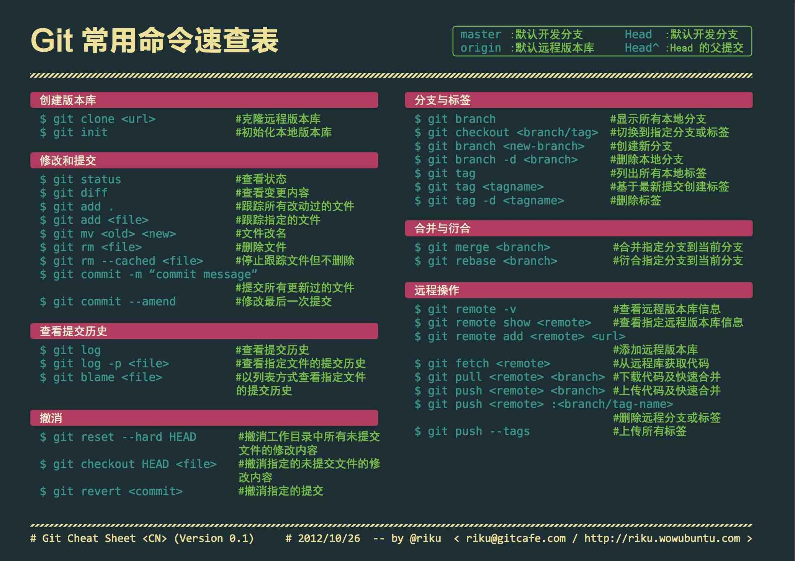

开源许可 GNU AGPL v3.0

文档作者: HITwh Vegetable Group :: ArHShRn

# 软件工程课程设计项目*

注意：此项目仍在开发中

Caution: This project is still under development

- 这是一个大学课程设计项目，Github仅用作版本控制，请在投入实际应用前仔细考虑。

- This project is a college Course Design, putting it on Github is only for Revision Control purpose. Consider carefully before applying it in your projects.

- 项目（包括所有文档）仅中文。

- The whole project (including docs) supports only Chinese.

  

  *具体名称见课程设计报告

  

## 简介

这是大学第三年软件工程课程设计项目*

对于项目中涉及到的内容，均有中文文档进行详细讲解。

*详细介绍请见课程设计报告

## 特点

- Edge Computing 边缘计算
- Docker，Kubernetes以及Server Clusters服务器集群
- Ansible 自动化部署
- Appveyor 持续集成

## 运行环境

### 前端

### 后端

- Ubuntu 16.04.5 LTS x3

# 合并分支与保持分支同步的正确操作

**警告：此过程操作失误将会导致版本库混乱，更严重的话需要重建远程仓库**

- **任何情况下未经所有组员同意不得对Master分支进行操作**

## 合并分支

**如果不知道 -no-ff squash rebase等的用法，请一定遵循以下步骤合并分支**

- **任何情况下未经所有组员同意不得对Master分支进行操作**

- 合并的时候不要用git bash，不要用任何桌面GUI应用程序

  

1. 提交自己分支的所有 commit 并 push 到远程仓库

2. 在需要合并的分支上打开一个Pull Request，此后不要点击 Merge 按钮

   （由于小组每个成员都是协作者，所以每个成员都能够 Merge Pull Request）

3. 在群里通知自己已经提交了PR准备合并

4. 组内成员对PR进行Review并处理冲突，决定是继续修改还是可以合并

5. 如果可以合并的话，PR提交者再上PR点击Merge按钮合并到其他分支

   

## 个人分支与Dev分支保持同步

- Master分支始终存放最稳定版本，所有个人分支均合并到Dev分支

- **如果不知道Mergy的用法不要直接把Master合并到其他分支，此过程操作失误将会导致HEAD指针偏离主线导致版本库和时间线混乱，更严重的话需要重建远程仓库**

- **千万不要在 Github Desktop 上点击 Choose a branch to merge into xxx**
- **任何情况下未经所有组员同意不得对Master分支进行操作**

1. 参考 **合并分支** 将个人分支合并到 Dev
2. 删除个人分支
3. 本地仓库 checkout 到 dev 分支并重命名为个人分支
4. push 到远程仓库

# 成员协作

## Git 常用指令速查表

## Git Recipes 高质量的Git中文教程

[**git-recipes**](https://github.com/hitwh-vegetable-group/git-recipes) forked from [**git-recipes**](https://github.com/geeeeeeeeek/git-recipes)

## 注意事项

### 敏感文档的处理

**在每次commit之前一定要仔细检查此项内容，否则将强制重建远程仓库，后果是丢失所有commit和branch**

1. 利用群里提供的 BECS AES解密器 解密敏感文档，会生成一个.tmp文件
2. 删除源文件，去掉解密文档的.tmp后缀
3. 更改内容并保存
4. 利用群里提供的 BECS AES加密器 加密敏感文档，会生成一个.tmp文件
5. 删除源文件，去掉加密文档的.tmp后缀
6. commit 更改

### 目前需加密文档（重要）

**如果修改了以下文件中的一个或者多个，一定要记住在commit之前加密，否则将强制重建远程仓库，后果是丢失所有commit和branch**

- [ ] .\doc\Kubernetes部署\environment.sh
- [ ] .\doc\Kubernetes部署\hosts_append
- [ ] .\doc\后端基础环境部署\项目服务器文档.md