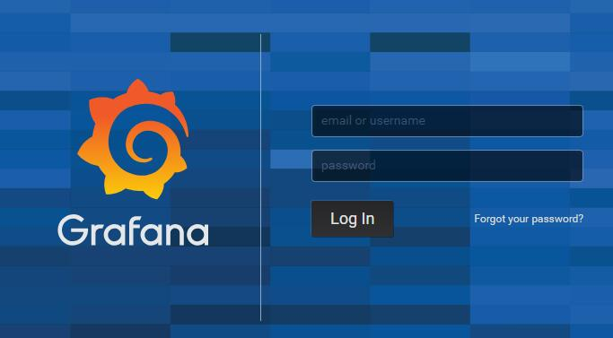
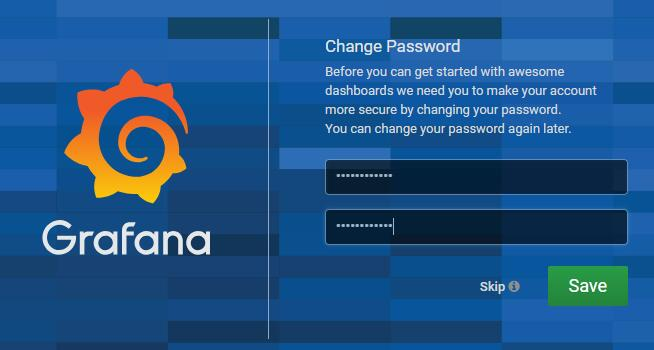
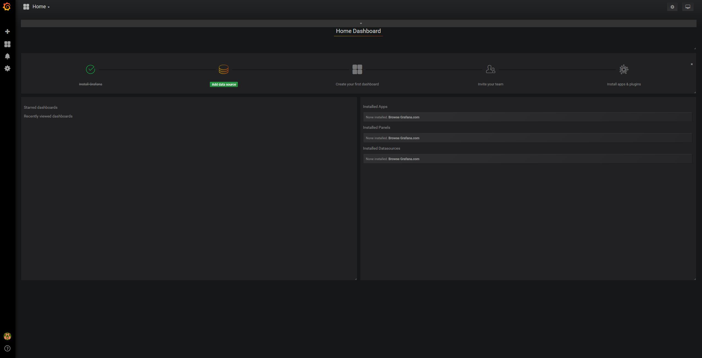
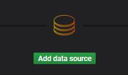
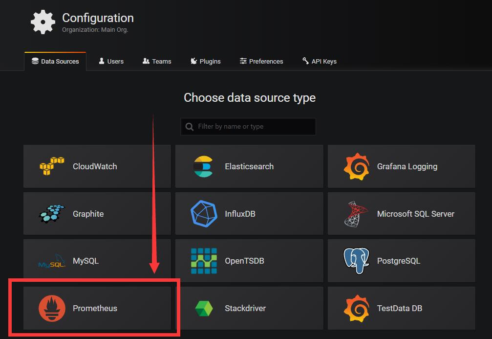
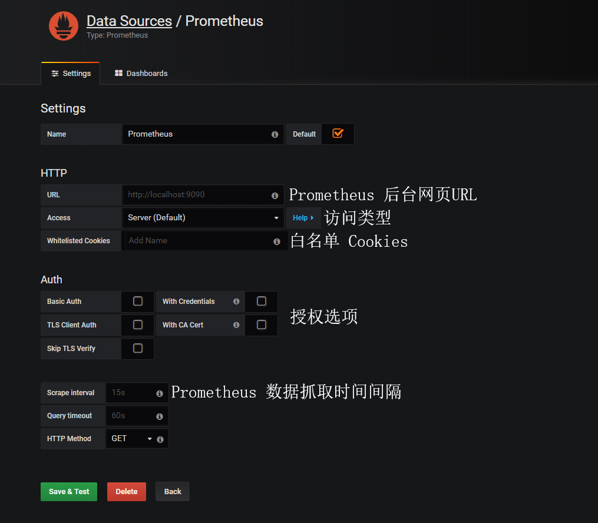
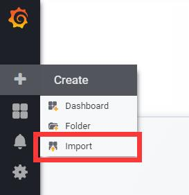

Grafana 仪表盘: 由StarsL.cn提供的仪表盘修改

文档作者: HITwh Vegetable Group :: ArHShRn

# 知识版权 Copyright  开源许可 License

文档：版权 ® HITwh很菜的小组 2019

源码（前端、后端Shell以及配置文件）：GNU AGPL v3.0 - 非商业用途、采用开源

Documents: Copyright ® [HITwh Vegetable Group](https://github.com/hitwh-vegetable-group) 2019 

Source Code(Frontend, Backend Shells and Configs): GNU AGPL v3.0 - **Noncommercial, Open Source**

## 版权许可 - 中文

本作品文档采用知识共享 署名-非商业性使用-相同方式共享 4.0 国际 许可协议进行许可。

要查看该许可协议，可访问 http://creativecommons.org/licenses/by-nc-sa/4.0/ 或者写信到 Creative Commons, PO Box 1866, Mountain View, CA 94042, USA。

## Copyright License - English

Documents containing in this work is licensed under the Creative Commons Attribution-NonCommercial-ShareAlike 4.0 International License. 

To view a copy of this license, visit http://creativecommons.org/licenses/by-nc-sa/4.0/ or send a letter to Creative Commons, PO Box 1866, Mountain View, CA 94042, USA.


# 镜像编译

基于Docker镜像搭建服务器节点资源监视平台，实现弹性分配

**Golang 需要 1.11 及以上版本才能成功编译 Prometheus 和 Node exporter**

## 所需镜像列表

| 镜像名称                 | 版本号  |
| :----------------------- | :-----: |
| - [x] Prometheus         |  2.5.0  |
| - [x] Node Exporter      | 0.17.0  |
| - [x] Kube State Metrics |  1.4.0  |
| - [x] Addon Resizer      | 1.8(.4) |
| - [x] Grafana            |  5.4.0  |

### Prometheus

1. 利用Go从Github获取Prometheus项目

   ```
   go get -d github.com/prometheus/prometheus
   ```

   

2. 进入项目目录并切换分支到 release-2.5

   ```
   cd $GOPATH/src/github.com/prometheus/prometheus
   git checkout release-2.5
   ```

   

3. 更改Dockerfile

   ```dockerfile
   FROM busybox:glibc
   LABEL maintainer="HITwh Vegetable Group <https://github.com/hitwh-vegetable-group>"
   
   COPY prometheus                             /bin/prometheus
   COPY promtool                               /bin/promtool
   COPY documentation/examples/prometheus.yml  /etc/prometheus/prometheus.yml
   COPY console_libraries/                     /usr/share/prometheus/console_libraries/
   COPY consoles/                              /usr/share/prometheus/consoles/
   
   RUN ln -s /usr/share/prometheus/console_libraries /usr/share/prometheus/consoles/ /etc/prometheus/
   RUN mkdir -p /prometheus && \
       chown -R nobody:nogroup etc/prometheus /prometheus
   
   USER       nobody
   EXPOSE     9090
   VOLUME     [ "/prometheus" ]
   WORKDIR    /prometheus
   ENTRYPOINT [ "/bin/prometheus" ]
   CMD        [ "--config.file=/etc/prometheus/prometheus.yml", \
                "--storage.tsdb.path=/prometheus", \
                "--web.console.libraries=/usr/share/prometheus/console_libraries", \
                "--web.console.templates=/usr/share/prometheus/consoles" ]
   ```

   

4. 构建工程文件

   ```
   make build
   ```

   

5. 构建镜像

   ```
   make docker
   ```

   

### Node Exporter

1. 利用Go从Github获取项目

   ```
   go get -d github.com/prometheus/node_exporter
   ```

   

2. 进入项目目录切换分支到 release-0.17

   ```
   cd $GOPATH/src/github.com/prometheus/node_exporter
   git checkout release-0.17
   ```

   

3. 更改Dockerfile

   ```dockerfile
   FROM busybox:glibc
   LABEL maintainer="HITwh Vegetable Group <https://github.com/hitwh-vegetable-group>"
   
   COPY node_exporter /bin/node_exporter
   
   EXPOSE      9100
   USER        nobody
   ENTRYPOINT  [ "/bin/node_exporter" ]
   
   ```

   

4. 构建工程文件

   ```
   make build
   ```

   

5. 构建镜像

   ```
   make docker
   ```

   

### Kube State Metrics

1. 利用Go从Github获取项目

   ```
   go get -d github.com/kubernetes/kube-state-metrics
   ```

   

2. 进入项目目录切换分支到 release-1.4

   ```
   cd $GOPATH/src/github.com/kubernetes/kube-state-metrics
   git checkout release-1.4
   ```

   

3. 更改Dockerfile

   ```dockerfile
   FROM busybox:glibc
   LABEL maintainer="HITwh Vegetable Group <https://github.com/hitwh-vegetable-group>"
   
   COPY kube-state-metrics /
   
   ENTRYPOINT ["/kube-state-metrics", "--port=8080", "--telemetry-port=8081"]
   
   EXPOSE 8080
   EXPOSE 8081
   ```

   

4. 构建工程文件

   ```
   make build
   ```

   

5. 构建镜像

   ```
   docker build -t hitwhvg/kube-state-metrics-arm64:v1.4.0 .
   ```

   

### Addon Resizer

- 开始之前：Addon Resizer 要求在进行本地编译的时候，Addon Resizer 本身的目录一定要在
  $GOPATH/src/k8s.io 下

1. 创建目录并从Github获取项目

   ```
   mkdir -p $GOPATH/src/k8s.io
   cd $GOPATH/src/k8s.io
   git clone https://github.com/kubernetes/autoscaler
   ```

   

2. 进入项目目录切换分支到 addon-resizer-release-1.8

   ```
   cd ./autoscaler
   git checkout addon-resizer-release-1.8
   ```

   

3. 更改Dockerfile

   ```
   cd ./addon-resizer
   vi Dockerfile
   ```

   ```dockerfile
   # Copyright 2016 The Kubernetes Authors. All rights reserved
   #
   # Licensed under the Apache License, Version 2.0 (the "License");
   # you may not use this file except in compliance with the License.
   # You may obtain a copy of the License at
   #
   #     http://www.apache.org/licenses/LICENSE-2.0
   #
   # Unless required by applicable law or agreed to in writing, software
   # distributed under the License is distributed on an "AS IS" BASIS,
   # WITHOUT WARRANTIES OR CONDITIONS OF ANY KIND, either express or implied.
   # See the License for the specific language governing permissions and
   # limitations under the License.
   
   FROM busybox:glibc
   LABEL maintainer="HITwh Vegetable Group <https://github.com/hitwh-vegetable-group>"
   
   ADD build/pod_nanny pod_nanny
   
   CMD ./pod_nanny
   ```

   

4. 构建镜像

   ```
   make docker
   ```

   

### Grafana

1. 利用Go从Github获取项目

   ```
   go get -d github.com/grafana/Grafana
   ```

   

2. 进入项目目录切换分支到 v5.4.0

   ```
   cd $GOPATH/src/github.com/grafana/Grafana
   git checkout v5.4.0
   ```

   

3. 修改Dockerfile

   选项1：全编译

   ```dockerfile
   # Golang build container
   FROM golang:1.11
   
   WORKDIR $GOPATH/src/github.com/grafana/grafana
   
   COPY Gopkg.toml Gopkg.lock ./
   COPY vendor vendor
   
   ARG DEP_ENSURE=""
   RUN if [ ! -z "${DEP_ENSURE}" ]; then \
         go get -u github.com/golang/dep/cmd/dep && \
         dep ensure --vendor-only; \
       fi
   
   COPY pkg pkg
   COPY build.go build.go
   COPY package.json package.json
   
   RUN go run build.go build
   
   # Node build container
   FROM node:8
   
   WORKDIR /usr/src/app/
   
   COPY package.json yarn.lock ./
   RUN yarn install --pure-lockfile --no-progress
   
   COPY Gruntfile.js tsconfig.json tslint.json ./
   COPY public public
   COPY scripts scripts
   COPY emails emails
   
   ENV NODE_ENV production
   RUN ./node_modules/.bin/grunt build
   
   # Final container
   FROM debian:stretch-slim
   LABEL maintainer="HITwh Vegetable Group <https://github.com/hitwh-vegetable-group>"
   
   ARG GF_UID="472"
   ARG GF_GID="472"
   
   ENV PATH=/usr/share/grafana/bin:/usr/local/sbin:/usr/local/bin:/usr/sbin:/usr/bin:/sbin:/bin \
       GF_PATHS_CONFIG="/etc/grafana/grafana.ini" \
       GF_PATHS_DATA="/var/lib/grafana" \
       GF_PATHS_HOME="/usr/share/grafana" \
       GF_PATHS_LOGS="/var/log/grafana" \
       GF_PATHS_PLUGINS="/var/lib/grafana/plugins" \
       GF_PATHS_PROVISIONING="/etc/grafana/provisioning"
   
   WORKDIR $GF_PATHS_HOME
   
   RUN apt-get update && apt-get upgrade -y && \
       apt-get install -qq -y libfontconfig ca-certificates && \
       apt-get autoremove -y && \
       rm -rf /var/lib/apt/lists/*
   
   COPY conf ./conf
   
   RUN mkdir -p "$GF_PATHS_HOME/.aws" && \
       groupadd -r -g $GF_GID grafana && \
       useradd -r -u $GF_UID -g grafana grafana && \
       mkdir -p "$GF_PATHS_PROVISIONING/datasources" \
                "$GF_PATHS_PROVISIONING/dashboards" \
                "$GF_PATHS_LOGS" \
                "$GF_PATHS_PLUGINS" \
                "$GF_PATHS_DATA" && \
       cp "$GF_PATHS_HOME/conf/sample.ini" "$GF_PATHS_CONFIG" && \
       cp "$GF_PATHS_HOME/conf/ldap.toml" /etc/grafana/ldap.toml && \
       chown -R grafana:grafana "$GF_PATHS_DATA" "$GF_PATHS_HOME/.aws" "$GF_PATHS_LOGS" "$GF_PATHS_PLUGINS" && \
       chmod 777 "$GF_PATHS_DATA" "$GF_PATHS_HOME/.aws" "$GF_PATHS_LOGS" "$GF_PATHS_PLUGINS"
   
   COPY --from=0 /go/src/github.com/grafana/grafana/bin/linux-amd64/grafana-server /go/src/github.com/grafana/grafana/bin/linux-amd64/grafana-cli ./bin/
   COPY --from=1 /usr/src/app/public ./public
   COPY --from=1 /usr/src/app/tools ./tools
   COPY tools/phantomjs/render.js ./tools/phantomjs/render.js
   
   EXPOSE 3000
   
   COPY ./packaging/docker/run.sh /run.sh
   
   USER grafana
   ENTRYPOINT [ "/run.sh" ]
   ```

   选项2：仅编译最终容器

   ```dockerfile
   # Stage 0
   FROM golang:1.11
   
   WORKDIR $GOPATH/src/github.com/grafana/grafana
   
   COPY Gopkg.toml Gopkg.lock ./
   COPY vendor vendor
   
   ARG DEP_ENSURE=""
   RUN if [ ! -z "${DEP_ENSURE}" ]; then \
         go get -u github.com/golang/dep/cmd/dep && \
         dep ensure --vendor-only; \
       fi
   
   COPY pkg pkg
   COPY build.go build.go
   COPY package.json package.json
   
   RUN go run build.go build
   
   RUN mkdir -p /usr/src/app/
   RUN cd /usr/src/app/
   RUN wget https://dl.grafana.com/oss/release/grafana-5.4.0.linux-amd64.tar.gz
   RUN tar -zxvf grafana-5.4.0.linux-amd64.tar.gz grafana-5.4.0/tools
   RUN tar -zxvf grafana-5.4.0.linux-amd64.tar.gz grafana-5.4.0/public
   RUN mv grafana-5.4.0/tools/ ./tools
   RUN mv grafana-5.4.0/public ./public
   
   # Final container
   FROM debian:stretch-slim
   LABEL maintainer="HITwh Vegetable Group <https://github.com/hitwh-vegetable-group>"
   
   ARG GF_UID="472"
   ARG GF_GID="472"
   
   ENV PATH=/usr/share/grafana/bin:/usr/local/sbin:/usr/local/bin:/usr/sbin:/usr/bin:/sbin:/bin \
       GF_PATHS_CONFIG="/etc/grafana/grafana.ini" \
       GF_PATHS_DATA="/var/lib/grafana" \
       GF_PATHS_HOME="/usr/share/grafana" \
       GF_PATHS_LOGS="/var/log/grafana" \
       GF_PATHS_PLUGINS="/var/lib/grafana/plugins" \
       GF_PATHS_PROVISIONING="/etc/grafana/provisioning"
   
   WORKDIR $GF_PATHS_HOME
   
   RUN apt-get update && apt-get upgrade -y && \
       apt-get install -qq -y libfontconfig ca-certificates && \
       apt-get autoremove -y && \
       rm -rf /var/lib/apt/lists/*
   
   COPY conf ./conf
   
   RUN mkdir -p "$GF_PATHS_HOME/.aws" && \
       groupadd -r -g $GF_GID grafana && \
       useradd -r -u $GF_UID -g grafana grafana && \
       mkdir -p "$GF_PATHS_PROVISIONING/datasources" \
                "$GF_PATHS_PROVISIONING/dashboards" \
                "$GF_PATHS_LOGS" \
                "$GF_PATHS_PLUGINS" \
                "$GF_PATHS_DATA" && \
       cp "$GF_PATHS_HOME/conf/sample.ini" "$GF_PATHS_CONFIG" && \
       cp "$GF_PATHS_HOME/conf/ldap.toml" /etc/grafana/ldap.toml && \
       chown -R grafana:grafana "$GF_PATHS_DATA" "$GF_PATHS_HOME/.aws" "$GF_PATHS_LOGS" "$GF_PATHS_PLUGINS" && \
       chmod 777 "$GF_PATHS_DATA" "$GF_PATHS_HOME/.aws" "$GF_PATHS_LOGS" "$GF_PATHS_PLUGINS"
   
   COPY --from=0 /go/src/github.com/grafana/grafana/bin/linux-amd64/grafana-server /go/src/github.com/grafana/grafana/bin/linux-amd64/grafana-cli ./bin/
   COPY --from=0 /usr/src/app/public ./public
   COPY --from=0 /usr/src/app/tools ./tools
   COPY tools/phantomjs/render.js ./tools/phantomjs/render.js
   
   EXPOSE 3000
   
   COPY ./packaging/docker/run.sh /run.sh
   
   USER grafana
   ENTRYPOINT [ "/run.sh" ]
   ```

   

4. 构建镜像

   ```
   make build-docker-full
   ```

   

# 服务器节点资源监视平台搭建

搭建成功后效果如图所示：


## 放通防火墙

推荐防火墙策略为：云服务器提供商处端口全开，用ubuntu内置防火墙ufw

放通3000 9090 9100端口

```bash
ufw allow 3000 && ufw allow 9090 && ufw allow 9100
```


## 启动监控服务

1. 创建启动脚本

   ```bash
   mkdir /home/monitor
   cd /home/monitor
   vi ./start_monitor.bash
   ```

   ```bash
   # License: GNU AGPL v3.0
   # Author: HITwh Vegetable Group :: ArHShRn
   #!/bin/sh
     
   #Promethus
   echo "Running Prometheus v2.5 ..."
   docker run -d --restart=always -p 9090:9090 --name=prometheus hitwhvg/prometheus:v2.5
   
   #Node Exporter
   echo "Running Node Exporter v0.17.0 ..."
   docker run -d --restart=always -p 9100:9100 --name=node-exporter hitwhvg/node-exporter:v0.17.0
   
   #Grafana
   echo "Running Grafana v5.4.0 ..."
   docker run -d --restart=always -p 3000:3000 --name=grafana hitwhvg/grafana:v5.4.0
   ```

   

2. 运行启动脚本

   ```bash
   bash ./start_monitor.bash
   ```

   

3. 访问端口测试是否启动成功

   ```
   curl localhost:9090
   ```

   预期结果

   ```html
   <a href="/graph">Found</a>.
   
   ```


## 配置 Prometheus 与 Node Exporter

Granafa将从数据源获取数据并将其可视化，所以必须要添加一个数据源才能正常使用Grafana。

在此我们使用的是 Prometheus 作为系统监控的数据源，并使用 Node Exporter 对数据导出为我们需要的数据，然后Grafana将会对其进行可视化。

于是首先，我们需要对 Prometheus 进行配置，让 Node Exporter 能够顺利导出 Prometheus 抓取的数据。

### 获取 Docker 网桥IP地址

由于我们创建的容器来运行这三个服务，所以这三个服务要成功互相通信则必须要知道真实主机（本机）的 Docker 网桥IP地址。

```
ip a | grep docker0
```

一般来说，地址应该为172.17.0.1

### 进入 Prometheus 的容器修改配置文件

1. 进入容器

   ```
   docker exec -it prometheus /bin/sh
   ```

   

2. 在配置文件最后添加一些代码并保存

   ```
   vi /etc/prometheus/prometheus.yml
   ```

   ```yaml
     - job_name: node_exporter
       static_configs:
         - targets: ['172.17.0.1:9100']
   ```

   

3. 退出容器

   ```
   exit
   ```

   

4. 重新启动容器

   ```
   docker restart prometheus
   ```

   

5. 进入 Prometheus 的 Targets 后台查看 Node Exporter 状态是否为 UP

   http://ServerIP:9090/targets

   

6. 如果为 DOWN 则配置错误，请检查防火墙状态以及在第2步填写的IP地址、端口号是否有误

## 配置Grafana

### 初次使用

1. 进入 SeverIP:3000 出现以下界面

   

2. 初始用户名以及密码均为admin，登陆过后Grafana将提示我们修改密码

   

3. 点击 Save 后将进入 Home Dashboard 界面

   

### 添加数据源

1. 点击Home Dashboard中的 Add data source

   

2. 选择 Prometheus

   

3. 出现如图所示页面，开始进行详细配置

   为了简化文档，我们只进行基本配置，于是只需要填写 Prometheus 后台网页URL即可

   请填写 http://172.17.0.1:9090

   

4. 点击 Save & Test 按钮，Grafana 将会检测是否能够成功抓取数据。如果完全按照本文档步骤的话是能够成功抓取的，如果不能成功抓取，请仔细参考本一级标题下的二级标题“配置 Prometheus 与 Node Exporter”中的内容。以下为成功后显示的消息：

   

### 添加本项目提供的JSON仪表盘

本项目的 Grafana 仪表盘由StarsL.cn提供的仪表盘修改而成，需要添加额外插件才能运行。

#### 给 Grafana 添加 Pie Chart 插件

1. 进入 Grafana 容器

   ```
   docker exec -it grafana /bin/sh
   ```

   

2. 输入命令行安装插件

   ```
   grafana-cli plugins install grafana-piechart-panel
   ```

   成功后显示

   ```
   installing grafana-piechart-panel @ 1.3.6
   from url: https://grafana.com/api/plugins/grafana-piechart-panel/versions/1.3.6/download
   into: /var/lib/grafana/plugins
   
   ✔ Installed grafana-piechart-panel successfully 
   
   Restart grafana after installing plugins . <service grafana-server restart>
   ```

   

3. 退出容器

   ```
   exit
   ```

   

4. 重新启动 Grafana 容器

   ```
   docker restart grafana
   ```

   

#### 添加本项目提供的JSON仪表盘

1. 打开 [**BECS 服务器节点监控面板.json**](https://github.com/hitwh-vegetable-group/BECS/blob/master/monitor/BECS-NODE%20Panel.json)

2. 进入 Grafana 面板，点击左边工具栏的 + 号图标，选择 Import

   

3. 拷贝  [**BECS 服务器节点监控面板.json**](https://github.com/hitwh-vegetable-group/BECS/blob/master/monitor/BECS-NODE%20Panel.json) 到如图所示位置，然后点击 Load

   

4. 之后请自行设置；在运行一段时间后将会出现监控数据，有关 Grafana 的更多用法请自行学习